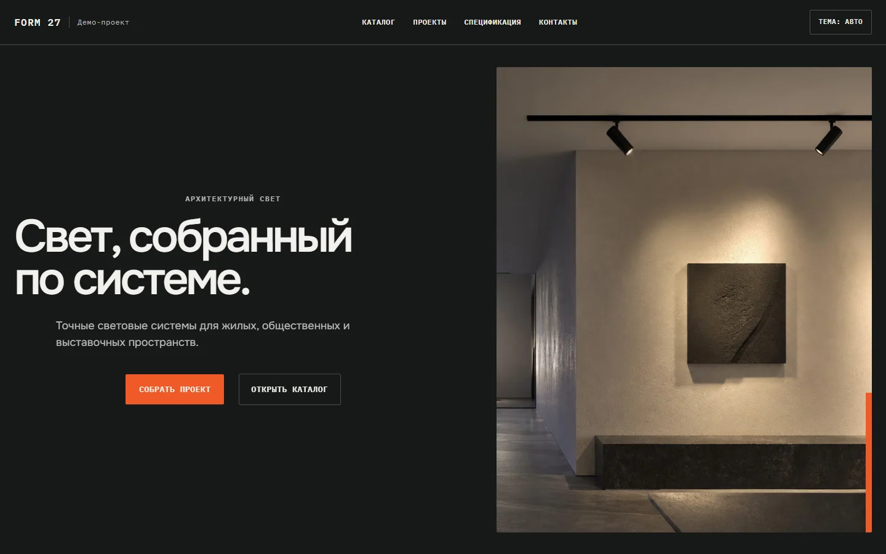

# FORM 27

FORM 27 — дизайн-ориентированный демонстрационный проект на WordPress для
вымышленного производителя архитектурного освещения. Он объединяет нативную
блочную тему, отдельный плагин, интерактивный конфигуратор светильников,
сохранение спецификации и создание PDF непосредственно в браузере.

Все товары, характеристики, цены, проекты и контактные данные вымышлены.
Репозиторий представляет собой портфолио-кейс, а не техническую документацию
или коммерческое предложение.



[Открыть постоянную статическую демоверсию](https://form27.andrey-digital.ru/).
[Открыть временную WordPress-демоверсию в Playground](https://playground.wordpress.net/?blueprint-url=https%3A%2F%2Fraw.githubusercontent.com%2FR1chardR0e%2Fform27-wordpress%2Fmain%2Fplayground-blueprint.json).
Дизайн и технические решения основаны на
[аудите исходников и опубликованного сайта «БЕРЕГ 61°»](docs/bereg-audit.md).

## Локальная разработка без Docker

Требования: Node.js 20.18 или новее и npm.

```bash
npm ci
npm run dev
```

Команда запускает чистую установку WordPress 7.0 / PHP 8.3 по адресу
`http://127.0.0.1:9400`, подключает тему и плагин, выполняет идемпотентное
заполнение демонстрационными данными и авторизует пользователя во временной
панели администратора. Системная установка PHP, базы данных или Docker не
требуется. База данных Playground является временной.

Публичная браузерная версия запускается с помощью файла
[`playground-blueprint.json`](playground-blueprint.json), находящегося в
репозитории. Он устанавливает готовые файлы из последнего выпуска GitHub,
поэтому для работы этой ссылки в репозитории должен существовать хотя бы один
выпуск.

## Альтернативный запуск через Docker

Docker не обязателен и отсутствовал в исходной среде разработки. Для обычной
установки с MariaDB выполните:

```bash
cp .env.example .env
# Замените все шаблонные пароли в файле .env.
npm run bootstrap:docker
```

Сайт использует порт `FORM27_HTTP_PORT`, а Mailpit —
`FORM27_MAILPIT_PORT`. Скрипт развёртывания не записывает пароль администратора
в репозиторий и не выводит его в консоль.

## Команды проверки качества и выпуска

```bash
npm run check
npm run test:e2e
npm run export:static
npm run test:e2e:static
npm run package
```

- `check` проверяет JavaScript, форматирование, структуру проекта и модульные
  тесты вспомогательных функций.
- `test:e2e` запускает изолированный Playground и проверяет интерфейс на ширине
  390, 768 и 1440 пикселей.
- `export:static` собирает каталог `dist/` из того же состояния WordPress с
  демонстрационными данными.
- `test:e2e:static` запускает полученный результат на отдельном тестовом порту
  и повторяет проверки интерфейса, доступности, создания PDF и отключённой
  отправки заявок.
- `preview:static` запускает настоящий эмулятор Cloudflare Pages на порту 8788
  для ручной проверки заголовков и перенаправлений.
- `test:lighthouse` проверяет главную, каталог и спецификацию. Минимальный порог
  для производительности, доступности и лучших практик составляет 0,95 на
  настольных устройствах и 0,90 на мобильных. Оценка SEO намеренно исключена,
  поскольку все страницы портфолио-демоверсии имеют директиву `noindex`.
- `package` создаёт в каталоге `release/` устанавливаемые ZIP-архивы темы и
  плагина, а также их контрольные суммы SHA-256.

Проверка синтаксиса PHP и стандартов оформления кода WordPress выполняется в
GitHub Actions на PHP 8.2 и 8.3, поскольку PHP не установлен на исходной рабочей
станции.

## Публичная публикация

Постоянная статическая демоверсия опубликована по адресу
[`form27.andrey-digital.ru`](https://form27.andrey-digital.ru/), а
[`form27-wordpress.pages.dev`](https://form27-wordpress.pages.dev/) сохранён как
резервный адрес Pages. Проект Cloudflare Pages напрямую подключён к репозиторию
`R1chardR0e/form27-wordpress`: каждое изменение в ветке `main` запускает
`npm run export:static` и публикует каталог `dist/`. GitHub Actions независимо
собирает и проверяет тот же результат. Дополнительный шаг публикации с
ограниченными правами доступа сохранён как резервный вариант.

Статическая версия поддерживает каталог, конфигуратор, локальное сохранение
проекта и экспорт PDF, но намеренно не сохраняет и не отправляет заявки по
электронной почте. Перед отправкой пользователь видит соответствующее сообщение.
Ссылка Playground остаётся полноценной CMS-демоверсией: каждый посетитель
получает отдельную временную базу данных, которая удаляется вместе с сессией
браузера.

Настройка публикации и секретов описана в
[`docs/deployment.md`](docs/deployment.md). Архитектура и контракты API описаны в
[`docs/architecture.md`](docs/architecture.md) и
[`docs/data-contract.md`](docs/data-contract.md).

## Лицензия

Код темы, плагина и проекта распространяется на условиях GPL-2.0-or-later.
Изображения, созданные для портфолио, можно использовать только в рамках условий
сервиса, с помощью которого они были сгенерированы.
